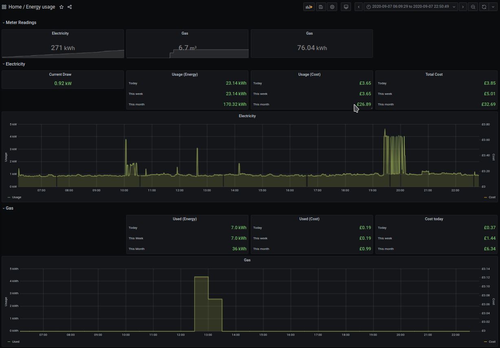

# energy-usage

Realtime energy usage reporting from Bright MQTT feed (SEP) into InfluxDB/VictoriaMetrics. Can be installed and run via pip or docker.

## Configuration

Copy `config.yaml.example` to `config.yaml` and fill in your MQTT login details, and your influx/vm server details.
The config file should be placed into one of the following locations:

* `/etc/energy-usage/config.yaml`
* `~/.config/energy-usage/config.yaml`
* Any dir pointed at by `ENERGY-USAGEDIR` env var

## Pip usage

### Installation

pip install energy-usage

### Run

```bash
energy-usage [--debug] [--noop]
```

* `--debug` enables verbose output about what the script is doing
* `--noop` mode will retrieve stats from mqtt, and show you what would be published to influx but does not actually send anything

## Docker usage

### Build

```bash
docker build -t energy-usage:latest .
```

### Run

```bash
docker run -v config.yaml:/etc/energy-usage/config.yaml energy-usage:latest
```

## Grafana

`grafana.energy-usage.json` contains an example Grafana dashboard which consumes this data (using the prometheus query interface of VictoriaMetrics).



Upon import of the dashboard, you will be prompted to select your datasource, and enter your unit and standing charges. These are used to plot the costs of realtime usage data, and the daily/weekly/monthly consumption using accumulated usage statistics by the meters. The dashboard does not currently use live tarrif data, as this is not provided in the Bright MQTT feed.

## Tested with:

* Python 3
* VictoriaMetrics 1.40
* Docker 19.03.05
* Nomad 0.12.4
